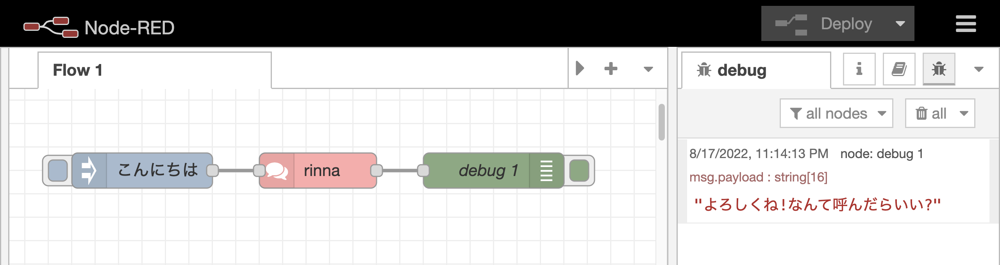
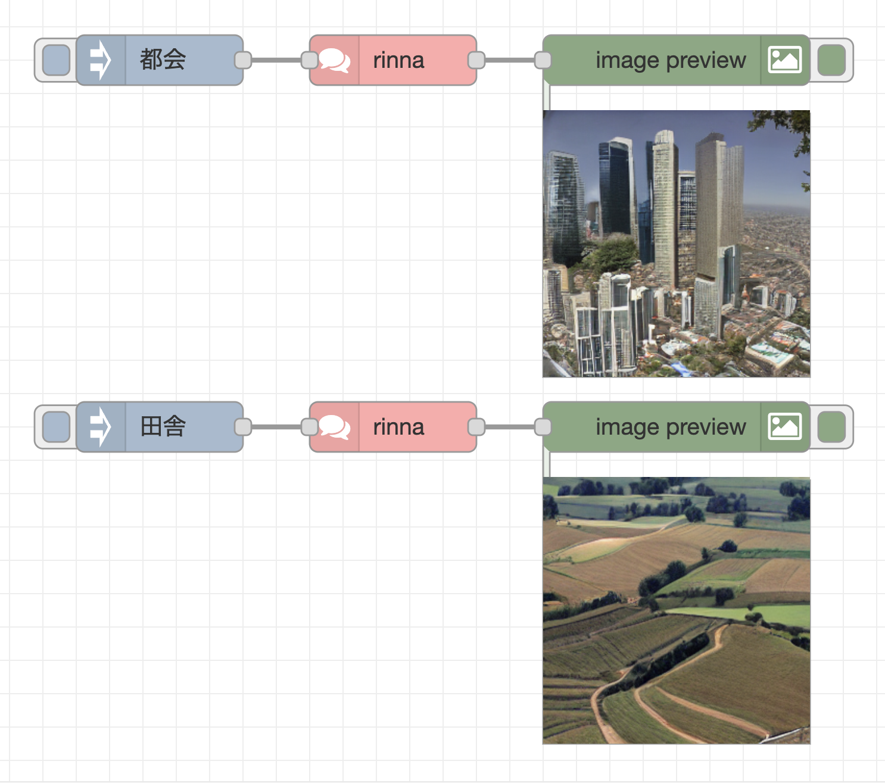

# node-red-contrib-rinna
Node-RED node to access rinna API (https://developers.rinna.co.jp/products)

## Examples
The flow files of the following demonstrations are available in the `examples` directory.

- 文章特徴付けAPI

- Text to Image API

